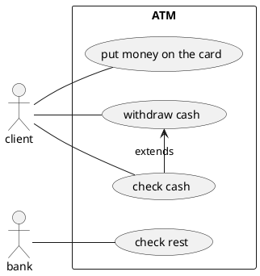

# Практическая работа 0
## Выполнил Шамов Н.О БИСО-03-20

```plantuml
@startuml
left to right direction
skinparam packageStyle rect
actor client
actor bank
rectangle ATM {
  client-- (check cash)
  client-- (withdraw cash)
  client-- (put money on the card)
  (withdraw cash) <- (check cash) : extends
  bank -- (check rest)
}
@enduml
```

